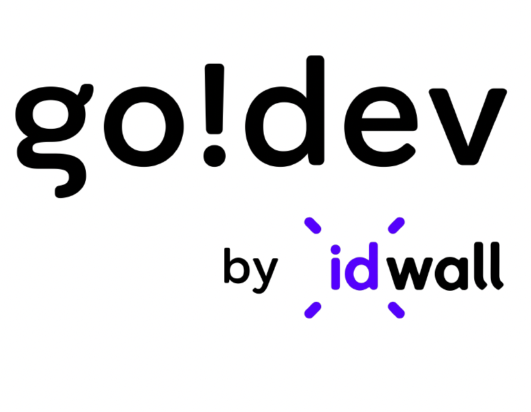

<figure align="center">
  
</figure>

<h1 align="center">
Repositório de código do bootcamp de desenvolvimento iOS go! dev
</h1>

## Log diário

**Dia 1:** Conceitos básicos de Swift: Arrays, Condicionais, Dicionários, Operadores e Variáveis

**Dia 2:** Conceitos básicos de Swift: Funções, If let e Guard Let, Optionals. Desafio: Construir uma pilha básica com Swift

**Dia 3:** Conceitos básicos de Swift: Enums, Map, Filter e Reduce. Desafio: Função palíndromo
